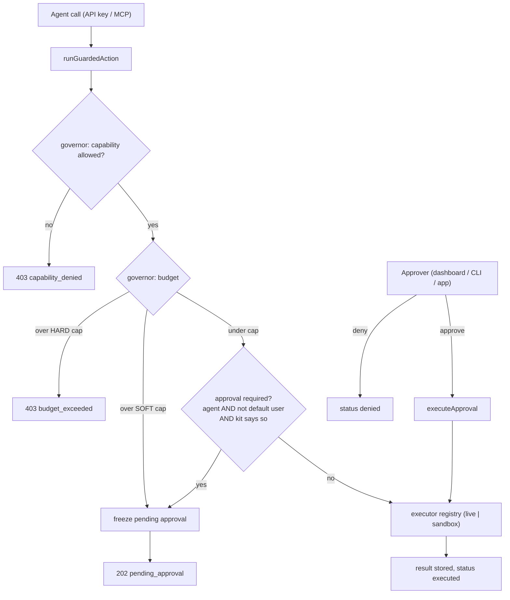

> ## Documentation Index
> Fetch the complete documentation index at: https://usenaive.ai/docs/llms.txt
> Use this file to discover all available pages before exploring further.

# Approvals (governance)

> How human-in-the-loop approval is enforced and executed.

Approvals gate sensitive agent actions behind a human decision, then execute
them server-side so the agent never has to retry.

## The gate

Every sensitive route delegates to `runGuardedAction(req, { actionType, payload })`,
which resolves the subject (`tenant_user` + AccountKit) and the actor, then hands the
whole thing to the **governor** — the closed enforcement engine — for a verdict. The
governor runs four stages **in this order**:

1. **Capability** — `capabilityAllowed(kit, actionType)`. Not allowed →
   `deny / capability_denied`.
2. **Budget pre-check** — committed spend + this action's amount, against the kit's
   window cap. Over a **hard** cap → `deny / budget_exceeded`. Over a **soft** cap →
   fall through to stage 3 with approval *forced*.
3. **Approval requirement** — see the exact condition below.
4. **Freeze** — persist the `pending` row and return
   `202 { status: "pending_approval", approval_id }`.

Approval is required when **all three** hold:

```
actor.type === "agent"        // a signed-in human is never gated
  && !subject.is_default_user // ← the carve-out, see below
  && resolveApprovalRequirement(kit, actionType)
```

`resolveApprovalRequirement` starts from the built-in `DEFAULT_APPROVAL_ACTIONS` set,
then applies the per-primitive `requiresApproval` override on the kit. A **soft** budget
cap forces approval regardless of that answer.

<Warning>
  **The default tenant\_user is not gated.** An agent API key acting on the company's
  *default* tenant\_user executes sensitive actions immediately — no approval row, no
  `202`. That is the deliberate solo-developer path in
  [multi-tenancy](/docs/architecture/multi-tenancy) (the default user *is* the approver), but
  it means approvals are a multi-tenant guarantee, not a single-tenant one. To exercise
  the gate in development, provision a real tenant user and scope the call to it.
</Warning>

The same gate runs for MCP tools that call `mcpGuard` — the card, trading, formation,
verification, domain-purchase, phone/mobile provisioning, compute, browser-signup,
connections-connect and send-email verbs, plus the three destructive brain verbs. A
tool that does *not* call `mcpGuard` gets no capability check and no approval
requirement; the revocation check and budget scope still apply to every MCP tool call —
see [the governance gateway](/docs/architecture/governance-gateway#the-second-place-mcp-binds-the-subject-policy-but-a-much-smaller-kit-gate).

## Deferred replay (single execution path)

There is one executor registry mapping `action_type → service call`
(`cards.create → createCard`, `domains.purchase → purchaseDomain`, …). Both the
immediate path and the post-approval path dispatch through it, so a frozen
action runs exactly as it would have live.

Each registration has a `live` leg and an **optional** `sandbox` leg; the governor's
verdict carries which one to run. A missing `sandbox` leg is meaningful, not an
oversight — the action refuses with `not_configured` rather than falling through to the
live one. See [Environments enforcement](/docs/architecture/environments-enforcement).



## Data

Pending and resolved approvals live in the `approvals` table, scoped to a
`tenant_user`: `action_type`, `primitive`, the frozen `payload`,
`requested_by_*`, `status` (`pending | executed | failed | denied | expired`),
`result` / `error`, and `resolved_by_*`. Creating, approving, and denying each
write an `activity_events` row (`approval.requested`, `approval.approved`, …)
and publish a live event for dashboards.

<Note>
  The `approvals` row is the **authoritative** record — the decision and its outcome are
  committed there before anything executes. The `activity_events` row beside it is
  **best-effort**: `logTenantEvent` catches and logs its own insert failure and returns
  `false`, deliberately, so that an audit-log write can never fail the business action it
  is describing. Reconcile against `approvals`, not against the activity log. See
  [the decision ledger](/docs/architecture/decision-ledger).
</Note>

## Approvers

Anyone authenticated for the company can resolve an approval: developers via the
dashboard or CLI (any of their tenant users), and end-users via your app
(scoped to their own `tenant_user`). PII-heavy payloads (e.g. KYC members) are
stored minimally and re-fetched at execution time.
