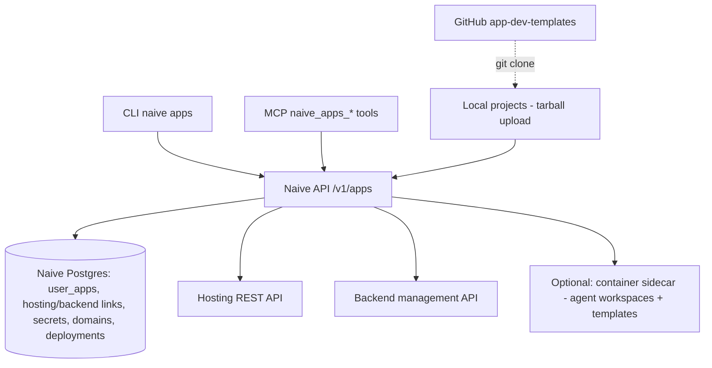

> ## Documentation Index
> Fetch the complete documentation index at: https://usenaive.ai/docs/llms.txt
> Use this file to discover all available pages before exploring further.

# Apps Infrastructure

> How the apps primitive provisions managed hosting and a managed backend — provisioning, deploys, credentials, and scoped provider proxies.

The apps primitive is a managed wrapper around two layers:

* **Hosting** — one project per app: hosting, deployments, environment variables, domains.
* **Backend** — one project per `fullstack` app: PostgreSQL, auth, storage, edge functions.

Naive holds the org-level provider credentials (`VERCEL_TOKEN`, `SUPABASE_PAT`). Tenants and agents never see them — every provider call is made by the Naive API on the app's behalf.

Apps are **decoupled from orchestration**: every operation works with just an API key. The agent container is an optional add-on that lets AI engineers build and deploy for you.

## Components

## Provisioning

`POST /v1/apps` (works standalone — no container required):

1. Creates a hosting project (`naive-{slug}-{shortId}`, Next.js framework, SSO protection disabled for iframe previews).
2. Returns a `template` block (public repo `usenaive/app-dev-templates`, path, clone command) so direct users can start building immediately. `workspaceMode` reports `"local"` or `"container"`.
3. **If the company has a claimed container**: creates a dedicated **engineer agent** on the sidecar and scaffolds the starter template (with the chosen `variant`) into its workspace. Without one, the agent row is registered as `pending` for later adoption — no sidecar calls are attempted.
4. Seeds `NEXT_PUBLIC_APP_URL` into the project env.
5. **fullstack** only: asynchronously creates a managed backend (free plan, `us-east-1`), polls until `ACTIVE_HEALTHY`, stores the project ref + keys (service-role key and DB password encrypted at rest), and injects `NEXT_PUBLIC_SUPABASE_URL` / `NEXT_PUBLIC_SUPABASE_ANON_KEY`. An in-flight guard prevents double provisioning.

`POST /v1/apps/:id/retry` re-runs whichever provider link is missing (compare-and-set guarded against concurrent retries). `DELETE /v1/apps/:id` deletes both provider projects and cascades all local records.

## Deploys

`POST /v1/apps/:id/deploy` has two modes:

* **Direct upload** (`Content-Type: application/gzip`): the caller uploads a tarball of their project (30 MB cap, entry validation against traversal/absolute paths, `node_modules`/`.git`/`.next` stripped). The API extracts it and continues with the shared pipeline below. This is what `naive apps deploy` does outside containers.
* **Workspace** (JSON): copies the source from the agent container — task workspace if a kanban task references the app, otherwise the engineer agent's workspace. A never-scaffolded workspace self-heals: the template is applied and the copy retried once. Without a container this mode fails fast with guidance to use direct upload.

Shared pipeline: files are uploaded to the hosting platform by SHA, a deployment is created, and a background watcher aliases it to the production domain once the build is `READY`. `publish` does the same for a specific historical deployment.

## Secrets

Secrets are encrypted in Naive's database (`ENCRYPTION_KEY`) and mirrored to the hosting project environment: `production` → production; `preview` → preview + development. Set upserts; delete removes the env var too.

## Scoped Provider Proxies

Because the curated endpoints can't cover everything the providers offer, the API exposes credential-injecting passthroughs:

| Route                                | Upstream                        | Scope enforcement                                                                                                                                                                                    |
| ------------------------------------ | ------------------------------- | ---------------------------------------------------------------------------------------------------------------------------------------------------------------------------------------------------- |
| `ANY /v1/apps/:id/vercel/proxy/*`    | `api.vercel.com`                | Path must reference the app's own project (`vN/projects/{id}/**`) or its deployments (`vN/deployments/**` — list calls get `projectId` forced; deployment IDs are verified to belong to the project) |
| `ANY /v1/apps/:id/supabase/proxy/*`  | `api.supabase.com`              | Path must be `v1/projects/{ref}/**` where `{ref}` is the app's project                                                                                                                               |
| `ANY /v1/apps/:id/db/rest/*`         | `{projectUrl}/rest/v1/*` (REST) | Inherently scoped — the URL and injected service-role key belong to this app only                                                                                                                    |
| `ANY /v1/apps/:id/storage/proxy/*`   | `{projectUrl}/storage/v1/*`     | Same — project URL + service-role key                                                                                                                                                                |
| `ANY /v1/apps/:id/auth/proxy/*`      | `{projectUrl}/auth/v1/*` (auth) | Same — project URL + service-role key                                                                                                                                                                |
| `ANY /v1/apps/:id/functions/proxy/*` | `{projectUrl}/functions/v1/*`   | Same — project URL + service-role key                                                                                                                                                                |

The data-plane proxies (`db/rest`, `storage`, `auth`, `functions`) share one handler (`proxySupabaseData`) that allowlists those four surface prefixes. They back the [Database](/docs/api-reference/database/overview), [Storage](/docs/api-reference/storage/overview), [Auth](/docs/api-reference/auth/overview), and [Edge Functions](/docs/api-reference/functions/overview) primitives, each individually gateable in Account Kits.

Deleting the underlying provider project through a proxy is blocked in all cases, and account/org-level paths are rejected with `403` — the org tokens grant access to every tenant's projects, so the path validation is the tenant isolation boundary.

## Multi-Tenancy

All routes are mounted both at `/v1/apps` (company scope) and `/v1/users/:user_id/apps` (per-user scope). On per-user mounts the subject's [Account Kit](/docs/architecture/account-kits) must enable the `apps` primitive, and every `:id` route verifies `tenant_user_id` ownership. The capability routes additionally enforce their own primitive (`database` / `storage` / `functions` / `auth`) on top of the `apps` gate — so a kit can grant app management but withhold, say, `auth`. New primitives are default-enabled on existing kits via migration `017_supabase_primitives_backfill.sql`.
