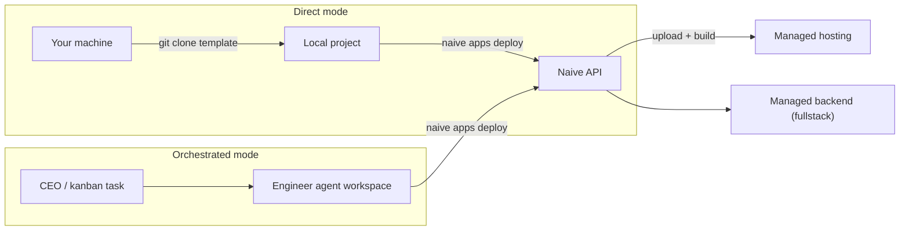

> ## Documentation Index
> Fetch the complete documentation index at: https://usenaive.ai/docs/llms.txt
> Use this file to discover all available pages before exploring further.

# Apps

> Web applications — managed Next.js apps with an optional managed backend. Build locally and deploy directly, or let AI engineer agents build for you.

Apps are managed web applications. Each app gets managed **hosting** (deployments, domains) plus — for fullstack apps — a dedicated **managed backend** (PostgreSQL, auth, storage, edge functions). Naive provisions and owns the underlying infrastructure and credentials, so you never need any separate account.

<Info>
  The common app lifecycle has first-class endpoints, and everything else is reachable through the [hosting proxy](/docs/api-reference/apps/vercel-proxy) and [backend proxy](/docs/api-reference/apps/supabase-proxy), which inject credentials and scope each call to your app's own project.
</Info>

## Two Ways to Work

Apps are **fully standalone** — no AI orchestration required. Choose the mode that fits:

|                         | Direct mode                                                                                 | Orchestrated mode                                                              |
| ----------------------- | ------------------------------------------------------------------------------------------- | ------------------------------------------------------------------------------ |
| **Who builds the code** | You, locally, with your own tools                                                           | A dedicated AI engineer agent in its workspace                                 |
| **Starter template**    | `git clone` from the [public templates repo](https://github.com/usenaive/app-dev-templates) | Auto-scaffolded into the agent's workspace                                     |
| **Deploy**              | `naive apps deploy <id>` inside your project directory (uploads it)                         | Agents run the same command in their workspace; CEO tasks deploy automatically |
| **Requires**            | Just an API key                                                                             | A company agent container (CEO/kanban)                                         |



## Direct Quickstart

```bash theme={"theme":"css-variables"}
# 1. Create the app — returns the template clone command
naive apps create --name "My Product" --type fullstack

# 2. Clone the starter template and build
git clone https://github.com/usenaive/app-dev-templates naive-app
cd naive-app/fullstack/saas-dashboard
# ... customize, npm install, npm run dev ...

# 3. Deploy from the project directory (uploads your code)
naive apps deploy <app-id>

# 4. Promote to production
naive apps publish <app-id> --deployment <deployment-id>
```

`naive apps templates` lists every available template with its clone command.

## App Types

| Type               | Infrastructure                                                | Use Case                                       |
| ------------------ | ------------------------------------------------------------- | ---------------------------------------------- |
| **frontend\_only** | Managed hosting (Next.js)                                     | Landing pages, marketing sites, static apps    |
| **fullstack**      | Managed hosting + managed backend (PostgreSQL, auth, storage) | SaaS products, dashboards, apps with databases |

## Starter Templates

Templates live in the public repo [`usenaive/app-dev-templates`](https://github.com/usenaive/app-dev-templates), organized as `{type}/{variant}`:

| Type            | Variants                                                                  |
| --------------- | ------------------------------------------------------------------------- |
| `frontend_only` | `dark-premium` (default), `clean-minimal`, `bold-energetic`, `warm-human` |
| `fullstack`     | `saas-dashboard` (default)                                                |

Every app's create response (and `naive apps show`) includes a `template` block with the repo URL, path, and a ready-to-run `cloneCommand`. In orchestrated mode the same template is scaffolded into the engineer agent's workspace automatically.

## Creating an App

```bash theme={"theme":"css-variables"}
naive apps create --name "StudyAI" --type fullstack --description "AI study assistant"
```

Returns the app ID, hosting project details, the default production domain (e.g., `naive-studyai-abc123.vercel.app`), and the `template` block.

| Flag            | Required | Description                                |
| --------------- | -------- | ------------------------------------------ |
| `--name`        | Yes      | App display name                           |
| `--type`        | Yes      | `frontend_only` or `fullstack`             |
| `--variant`     | No       | Starter template variant (see table above) |
| `--description` | No       | Short description                          |

For **fullstack** apps, backend provisioning starts immediately in the background. Once the project is healthy, the backend URL and anon key are automatically injected as environment variables.

## Deployment Workflow

### Preview Deployment

```bash theme={"theme":"css-variables"}
# Direct mode — run inside your project directory (or pass --dir)
naive apps deploy <app-id>
naive apps deploy <app-id> --dir ./my-project
```

The CLI packs your project (excluding `node_modules`, `.next`, `.git`) and uploads it through the Naive API. Inside agent containers, the same command deploys the agent's workspace instead. Returns a unique preview URL — poll `naive apps deployments <app-id>` for build status.

### Promote to Production

```bash theme={"theme":"css-variables"}
naive apps publish <app-id> --deployment <deployment-id>
```

Waits for the deployment to be `READY`, then aliases it to the production domain. Zero-downtime switch.

### Deployment History

```bash theme={"theme":"css-variables"}
naive apps deployments <app-id>
```

## Environment Variables

Secrets are stored encrypted by Naive and synced to the app's environment variables (`production` → production; `preview` → preview + development):

```bash theme={"theme":"css-variables"}
naive apps secrets set <app-id> PAYMENTS_KEY sk_live_... --target production
naive apps secrets list <app-id>
naive apps secrets reveal <app-id> PAYMENTS_KEY --target production
naive apps secrets delete <app-id> PAYMENTS_KEY --target preview   # also removed from the app environment
```

Redeploy after changing secrets for them to take effect.

<Info>
  Provisioned automatically: `NEXT_PUBLIC_APP_URL` (all apps), `NEXT_PUBLIC_SUPABASE_URL` and `NEXT_PUBLIC_SUPABASE_ANON_KEY` (fullstack apps).
</Info>

## Domains

```bash theme={"theme":"css-variables"}
naive apps domains add <app-id> myapp.com               # BYOD — you point DNS at the app
naive apps domains connect <app-id> <domain-id>         # company domain (system: platform writes DNS)
naive apps domains verify-dns <app-id> <domain-id>      # app HTTP verify — not `naive domains verify`
naive apps domains set-primary <app-id> <app-domain-id> # what production publishes to
```

For `{slug}.usenaive.ai`: do not `domains set-record` or dig-and-wait 48h. A company `dns_status=pending_verification` is Resend **email** lag — ignore it for app attach (`app_connect_status` / verify-dns is the front door).

## Backend Capabilities (Fullstack Only)

A fullstack app's backend is exposed as four first-class primitives — usable for your own app and, via `forUser(id)`, for each of your end-users' apps:

* **[Database](/docs/getting-started/database)** — SQL, REST CRUD, schema changes
* **[Storage](/docs/getting-started/storage)** — buckets & objects
* **[Edge Functions](/docs/getting-started/functions)** — list, deploy, invoke
* **[Auth](/docs/getting-started/auth)** — auth config & admin users

```bash theme={"theme":"css-variables"}
naive apps db tables <app-id>
naive apps db query <app-id> "SELECT count(*) FROM users"
naive apps db query <app-id> "CREATE TABLE notes (id serial primary key, body text)"
```

```ts theme={"theme":"css-variables"}
// SDK — operate on the app's backend
await naive.database.query("select count(*) from users");
await naive.storage.createBucket("avatars", { public: true });
await naive.auth.users.list();
```

In your app code, use `@supabase/supabase-js` with the auto-injected env vars for queries, auth, and storage.

## Full Platform Access (Advanced)

The proxies expose **the entire underlying hosting and backend platform APIs**, scoped to your app's own project:

```bash theme={"theme":"css-variables"}
naive apps vercel <app-id> GET "v3/deployments/<deployment-id>/events"   # build logs
naive apps vercel <app-id> PATCH "v9/projects/<project-id>" --body '{"buildCommand":"next build"}'
naive apps supabase <app-id> GET "v1/projects/<ref>/functions"           # edge functions
naive apps supabase <app-id> PATCH "v1/projects/<ref>/config/auth" --body '{"site_url":"https://myapp.com"}'
```

See the [hosting proxy](/docs/api-reference/apps/vercel-proxy) and [backend proxy](/docs/api-reference/apps/supabase-proxy) references for scoping rules, and the official [hosting](https://vercel.com/docs/rest-api) / [backend](https://supabase.com/docs/reference/api) platform docs for the full operation catalog.

## Retry Failed Provisioning

```bash theme={"theme":"css-variables"}
naive apps retry <app-id>
```

Re-creates the hosting project and/or backend if they were never linked (works even when the app shows `active` but its background backend provisioning failed).

## Deleting an App

```bash theme={"theme":"css-variables"}
naive apps delete <app-id>
```

Deletes the hosting project, the backend (if fullstack), all secrets, domains, deployment records, and archives the associated engineer agent. Irreversible.

## Agent Integration (Orchestrated Mode)

When the company has an agent container and the CEO creates a plan that includes apps, it:

1. Creates apps with `naive apps create` — the starter template is scaffolded into a dedicated engineer agent's workspace
2. Creates tasks with explicit deployment instructions
3. Workers build the code and run `naive apps deploy` + `naive apps publish` automatically

Apps created **before** the container exists work too — the engineer agent is registered as `pending` and orchestration picks it up later, while you can build and deploy directly the whole time.
