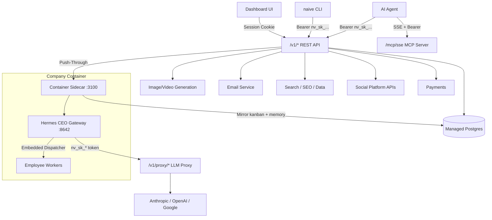

> ## Documentation Index
> Fetch the complete documentation index at: https://usenaive.ai/docs/llms.txt
> Use this file to discover all available pages before exploring further.

# Introduction

> Naïve gives every AI agent its own governed real-world agent profile — verified identity, a spend-capped card, comms, and a runtime, per tenant.

**Naïve gives every AI agent its own real-world agent profile:** a verified business
identity (KYC/EIN/formation), a spend-capped card, an inbox and phone number, and
(optionally) a place to run — provisioned **per end-user**, governed on every
action, and **instantly revocable**.

The unit is the **bundle**: identity + money + comms + runtime as one per-tenant
agent profile, governed together — each of your customers' agents gets its own
incorporated entity, inbox, number, card, and runtime as one governed unit.

## How it's organized

```
organization → project → (account kit → child project → primitives)
```

Your **organization** is what you signed up as; it holds the API keys. A **project** is a
scope inside it, holding [account kits](/docs/getting-started/account-kits) (policy) and **child
projects** — one per end-user, each with its own agent profile and primitives. Every
organization has a **default project**, so you only meet the layer when you want a second
scope. See [Projects](/docs/getting-started/projects).

## Works with the runtime you already use

Naïve is **runtime-agnostic**. Provision an agent profile, pull its governed tools, and
run the agent inside any agent framework, your own harness, or Naïve's hosted
containers. Frameworks give an agent durability and a sandbox; Naïve gives it a legal
identity, a card, and registered comms — and governance (spend caps, approvals, audit,
revoke) holds no matter where the agent runs.

## CLI First

```bash theme={"theme":"css-variables"}
# Install CLI
npm install -g @usenaive-sdk/cli

# Register, scaffold a template, and provision an agent profile
naive register --name "My Agent" --email owner@example.com --password securepassword123
naive init            # scaffold naive.config.ts (defineProject: infrastructure, kits, one team)
naive up              # apply it
naive agent-profiles provision support --user <tenant>
```

## What's Different

* **The full per-tenant agent profile bundle** — its own legal entity + comms + money + runtime, governed as one. Not just a card attached to someone's wallet.
* **The governance gateway** — every regulated action (a charge, a send, a refund) routes through a policy proxy: spend caps, approvals, audit, and one-click revoke at the tool-call boundary, across the whole agent profile. ([Where it binds, and the two places it does not.](/docs/architecture/governance-gateway#where-the-kit-binds--and-the-two-places-it-does-not))
* **Per-tenant comms** — phone numbers, A2P/10DLC registration, custom-domain email with isolated sending reputation.
* **Self-service onboarding** — agents can register, link accounts, and mint API keys without human intervention.
* **Identity-aware** — every primitive knows what resources the agent profile has ("what inboxes do I own?").
* **MCP-native** — hosted MCP server runs alongside REST on the same instance.
* **Agent-discoverable** — `GET /skill.md` returns everything an agent needs to get started.

## Three Ways to Connect

<CardGroup cols={3}>
  <Card title="REST API" icon="code">
    Standard HTTP with `Authorization: Bearer nv_sk_...`
  </Card>

  <Card title="MCP Server" icon="plug">
    SSE transport at `/mcp/sse` — works with any MCP client.
  </Card>

  <Card title="CLI" icon="terminal">
    `naive` command for terminal workflows and agentic use
  </Card>
</CardGroup>

## Orchestration (optional)

Naïve can also host and coordinate agents directly. This is **controlled autonomy**:
humans stay on the exceptions via approvals and audit, not "no humans in the loop." It's
optional — most teams adopt Naïve for the regulated agent profile bundle first and bring
their own runtime.

<Note>
  **Two runtimes, and the table below is the older one.** The surface in this table — a
  persistent CEO gateway that decomposes objectives into tasks and dispatches them to AI
  employees — is the **legacy orchestration runtime**. It is frozen: every command and route
  keeps working and accepts no new capabilities.

  New work declares a `team({ lead, agents })` on `runtime.durable()` and sends it work with
  `naive teams submit`. Start at [Teams](/docs/getting-started/teams), which also states exactly
  which of its operations are served on this API build and which answer `501`.
</Note>

| Feature            | What it does                                                                                     | CLI                |
| ------------------ | ------------------------------------------------------------------------------------------------ | ------------------ |
| **CEO Agent**      | Persistent gateway that interprets prompts, proposes teams, creates tasks, dispatches to workers | `naive ceo`        |
| **Tasks (Kanban)** | Unit of work — create, assign, complete, block; embedded dispatcher auto-spawns workers          | `naive tasks`      |
| **Objectives**     | Strategic goals (weeks-to-months) that decompose into tasks                                      | `naive objectives` |
| **Employees**      | AI workforce — hire, fire, configure agents with roles and skills                                | `naive employees`  |
| **Cron Jobs**      | Scheduled recurring prompts via Hermes gateway Jobs API                                          | `naive cron`       |
| **Memory**         | Persistent context owned by Hermes, mirrored to the managed database                             | `naive memory`     |

## Available Primitives

| Primitive                      | What it does                                                                                                                                                                           | Cost                                                                                                                                         |
| ------------------------------ | -------------------------------------------------------------------------------------------------------------------------------------------------------------------------------------- | -------------------------------------------------------------------------------------------------------------------------------------------- |
| **Apps**                       | Managed web apps — managed Next.js hosting with optional managed backend, full platform API access via scoped proxies                                                                  | Not currently metered ([planned](/docs/getting-started/credits#infrastructure-duration-metered) \~0.15 credits/hr per deployed app)               |
| **Database**                   | Managed Postgres on a fullstack app — SQL, REST CRUD, migrations (for your project or your users')                                                                                     | Not currently metered ([planned](/docs/getting-started/credits#infrastructure-duration-metered) \~0.3 credits/hr while provisioned; queries free) |
| **Storage**                    | File storage buckets & objects on a fullstack app's managed backend                                                                                                                    | Not currently metered ([planned](/docs/getting-started/credits#infrastructure-duration-metered) \~0.02 credits/hr per bucket; operations free)    |
| **Edge Functions**             | List, deploy & invoke serverless edge functions on a fullstack app                                                                                                                     | Free                                                                                                                                         |
| **Auth**                       | End-user authentication & admin user management on a fullstack app                                                                                                                     | Free                                                                                                                                         |
| **Domains**                    | System domain auto-provisioning, custom domain (BYOD), DNS verification, agent DNS record editing                                                                                      | Free                                                                                                                                         |
| **Email**                      | Create inboxes, send/receive emails (identity-aware)                                                                                                                                   | 0.016 credits/send                                                                                                                           |
| **Search**                     | Web search, URL extraction, deep research with citations                                                                                                                               | 0.05-1.6 credits                                                                                                                             |
| **[Agents](/docs/agents/overview)** | One durable agent per child project — wakes on a cron entry, an API call or a webhook, spends a **required** hard budget, and ends its work in a deliverable. Max 25 per child project | Dynamic (model tokens + paid tools); idle costs storage only                                                                                 |
| **LLM**                        | OpenRouter-backed chat completions across 300+ models (drop-in OpenRouter wrapper)                                                                                                     | Dynamic (per-token)                                                                                                                          |
| **Images**                     | Generate AI images (FLUX, SD 3.5, Recraft), stock photos                                                                                                                               | Dynamic                                                                                                                                      |
| **Video**                      | Generate AI video (Kling, Minimax, Wan)                                                                                                                                                | Dynamic                                                                                                                                      |
| **Audio**                      | Transcription, speech synthesis & native audio conversations, routed across a managed speech-model catalog                                                                             | Dynamic                                                                                                                                      |
| **Social**                     | Post to 10+ platforms via Naive's social infrastructure — connect, post, schedule, analytics                                                                                           | 2.5 credits/publish (+X surcharges)                                                                                                          |
| **SEO**                        | Keyword research, backlinks, competitor analysis                                                                                                                                       | Dynamic                                                                                                                                      |
| **App Data**                   | App rankings, reviews, metadata from Google Play and App Store                                                                                                                         | Dynamic                                                                                                                                      |
| **Travel**                     | Hotel and place discovery via Google Hotels and TripAdvisor search                                                                                                                     | Dynamic                                                                                                                                      |
| **Reviews**                    | Reputation and review intelligence from Google, Trustpilot, TripAdvisor, and social signals                                                                                            | Dynamic                                                                                                                                      |
| **AEO**                        | AI search optimization — LLM responses, mentions, AI keyword volume                                                                                                                    | Dynamic                                                                                                                                      |
| **E-commerce**                 | Product listings, pricing, sellers from Google Shopping and Amazon                                                                                                                     | Dynamic                                                                                                                                      |
| **Cards**                      | Virtual cards for agent spending, funding, and assignment workflows                                                                                                                    | Dynamic                                                                                                                                      |
| **Phone**                      | Provision US phone numbers and send/receive SMS (carrier-registered 10DLC)                                                                                                             | Metered (provision + monthly rental + per-SMS)                                                                                               |
| **Trading**                    | Link a brokerage account (OAuth) and trade stocks, options & crypto — account, positions, orders, market data                                                                          | Free (passthrough)                                                                                                                           |
| **Verification**               | Identity verification (KYC) for founders                                                                                                                                               | 60 credits/member                                                                                                                            |
| **Formation**                  | LLC company formation — submit, track, download documents                                                                                                                              | \$349 (hosted checkout)                                                                                                                      |
| **Jobs**                       | Unified async tracking for all long-running operations                                                                                                                                 | Free                                                                                                                                         |
| **Customer Billing**           | Per-tenant plans, subscriptions & metered usage quotas for *your* end-customers (plan → Account Kit + quota)                                                                           | Free                                                                                                                                         |
| **Webhooks**                   | Per-tenant outbound event subscriptions — signed, retried delivery of `email.received` / `sms.received` / `approval.resolved`                                                          | Free                                                                                                                                         |
| **Billing**                    | Your own Naive plan ($20/mo), credit top-ups ($10-100), domain purchases                                                                                                               | —                                                                                                                                            |

## Architecture



## What's Available

Once connected, your agent has access to all available MCP tools and a full REST API. Here are some things to try:

| Try this                                   | What happens                                         |
| ------------------------------------------ | ---------------------------------------------------- |
| "Search the web for AI frameworks"         | Calls `naive_web_search` — real-time web results     |
| "Create an email inbox for outreach"       | Calls `naive_create_inbox` on your company domain    |
| "Generate a logo for my product"           | Calls `naive_generate_images` using FLUX models      |
| "Create a product demo video"              | Calls `naive_generate_video` using Kling models      |
| "Research the competitive landscape"       | Calls `naive_research` for multi-step synthesis      |
| "Find keyword opportunities for our blog"  | Calls `naive_seo_execute` — keyword data             |
| "Check our competitor's backlink profile"  | Calls `naive_seo_execute` — backlink analysis        |
| "What does ChatGPT say about our product?" | Calls `naive_aeo_execute` — LLM response tracking    |
| "Compare headphone prices on Amazon"       | Calls `naive_ecommerce_execute_async` — product data |
| "Get reviews for our app on Google Play"   | Calls `naive_app_data_execute_async` — app reviews   |

## Next Steps

<CardGroup cols={2}>
  <Card title="Quickstart" href="/docs/getting-started/quickstart">
    Register and make your first API call in 2 minutes
  </Card>

  <Card title="Orchestration" href="/docs/getting-started/orchestration">
    Set up your AI workforce with CEO, employees, and kanban
  </Card>

  <Card title="Authentication" href="/docs/getting-started/authentication">
    API key format, auth flow, and error handling
  </Card>

  <Card title="Credits" href="/docs/getting-started/credits">
    Sync vs async billing, dynamic model pricing
  </Card>
</CardGroup>
