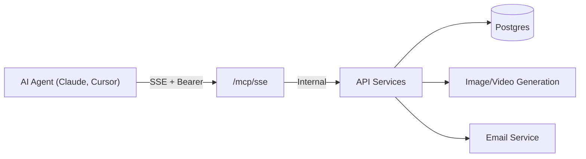

> ## Documentation Index
> Fetch the complete documentation index at: https://usenaive.ai/docs/llms.txt
> Use this file to discover all available pages before exploring further.

# MCP Server

> Hosted Model Context Protocol server — connect Claude, Cursor, or any MCP client.

The Naive API v2 includes a **hosted MCP server** running on the same instance as the REST API. This means agents can connect directly without running any local processes.

## Architecture



Unlike the original Naive MCP (which ran as a local stdio subprocess), this is a **remote SSE server**. The agent connects over the network.

## Connection

```
SSE Endpoint: https://api.usenaive.ai/mcp/sse
Messages:     https://api.usenaive.ai/mcp/messages
Auth:         Authorization: Bearer nv_sk_live_...
```

## Claude Desktop Configuration

```json theme={"theme":"css-variables"}
{
  "mcpServers": {
    "naive": {
      "type": "sse",
      "url": "https://api.usenaive.ai/mcp/sse",
      "headers": {
        "Authorization": "Bearer nv_sk_live_..."
      }
    }
  }
}
```

## Cursor Configuration

```json theme={"theme":"css-variables"}
{
  "mcpServers": {
    "naive": {
      "type": "sse",
      "url": "https://api.usenaive.ai/mcp/sse",
      "headers": {
        "Authorization": "Bearer nv_sk_live_..."
      }
    }
  }
}
```

## How It Works

1. Agent opens SSE connection to `/mcp/sse` with Bearer auth
2. Server sends back session ID
3. Agent sends tool calls via `POST /mcp/messages?sessionId=...`
4. Server executes the tool using internal services and returns result
5. Connection stays open for the session duration

## Governance on this transport

Every tool call goes through one dispatcher tail: **scope → revoke → kit gate → budget
scope**, the same order `gatePrimitive()` uses on HTTP, so the two surfaces cannot give
different reasons for the same refusal. The subject and the AccountKit are re-resolved
per call, so a revoke or a kit edit takes effect mid-session with no reconnect.

| Control                                                  | HTTP                   | MCP                                                                            |
| -------------------------------------------------------- | ---------------------- | ------------------------------------------------------------------------------ |
| Agent-profile revoke                                     | mutating requests only | **every tool call**, reads included                                            |
| Combined cost ceiling + spend attribution                | bound per request      | bound per tool call                                                            |
| Kit primitive gate                                       | every gated mount      | 23 tools at the dispatcher + 26 in-handler; **222 of 271 assert no primitive** |
| Capability (`can`) / approval (`approve`) — the governor | every guarded route    | **28 of 271** tool registrations, via `mcpGuard`                               |

<Warning>
  **Two rows above are narrower here, and both are worth knowing before you write a
  policy.** 222 of the 271 tools a session is offered assert no kit primitive at all, so
  switching a primitive off stops 49 of them and not the rest. And `can` / `approve` are
  consulted only where a handler calls `mcpGuard` — the card, trading, formation,
  verification, domain-purchase, phone/mobile, compute, browser-signup, connection and
  `naive_send_email` verbs, plus the three destructive brain verbs. Measurement:
  [the governance gateway](/docs/architecture/governance-gateway#the-second-place-mcp-binds-the-subject-policy-but-a-much-smaller-kit-gate).
</Warning>

## Available Tools

The server declares **318** `naive_*` tools, documented across three pages:

| Page                                                      | Covers                                                                                                                                             |
| --------------------------------------------------------- | -------------------------------------------------------------------------------------------------------------------------------------------------- |
| [Tool list](/docs/mcp/tools)                                   | connections, vault, approvals, browser, email, phone, search, people, company data, social data, LLM, media, cards, payments, trading and the rest |
| [Brain tools](/docs/mcp/brain)                                 | the 21 `naive_brain_*` content tools                                                                                                               |
| [Runtime & brain governance](/docs/mcp/runtime-and-governance) | the 5 `naive_teams_*` runtime tools, the 7 `naive_agent*` long-horizon supervision tools, and the 5 `naive_brain_*` governance tools               |

<Warning>
  **Declared is two more than a default deployment advertises**, for one reason:

  * `naive_clone_generate` and `naive_clone_status` are behind the private-beta flag
    `CLONE_GENERATE_ENABLED`, which `platform/kernel/src/config.ts` defaults to `false`.
    Turn it on and a session is offered both. This is a deliberate gate, not a gap.

  The gap used to be six. The other four were the `naive_audio_*` tools: `mcp/tools/audio.ts`
  declared them, `packages/api/src/mcp/server.ts` imported `registerAudioTools`, and no
  `TOOL_MODULES` row ever called it — so they were documented on [the tool list](/docs/mcp/tools)
  and offered to no client, from `chore/decompose-v1` onward. They are registered now, behind
  the same `audio` primitive that already gates `POST /v1/audio/transcriptions`, so a kit that
  enables audio gets them and a kit that disables it is refused on both surfaces.

  The count above is the one `ci/spec-drift-tools.test.ts` measures, which scans source text; the
  count a client sees is `toolAuthorizationInventory`'s, pinned by `mcp-tool-listing.test.ts`.
</Warning>

<Note>
  **The list is per tenant, not per server.** What a session is offered is filtered by the resolved
  tenant user's Account Kit: a tool whose primitive the kit disables is withheld, because a listed
  tool that is certain to be refused teaches a model a capability it does not have. Tools that are
  *allowed but need approval* stay listed — hiding an authority decision would give the model the
  wrong one of two policies. `GET /v1/users/{user_id}/sessions/{id}/tools` renders the exact list a
  session will see.
</Note>

<Note>
  The seven `naive_*` tools the Node SDK's `agentTools()` produces are a different, deliberately
  compressed set — a model gets `naive_run_primitive` + `naive_search_primitives` rather than 273
  definitions. They are documented with the SDK, not here.
</Note>
